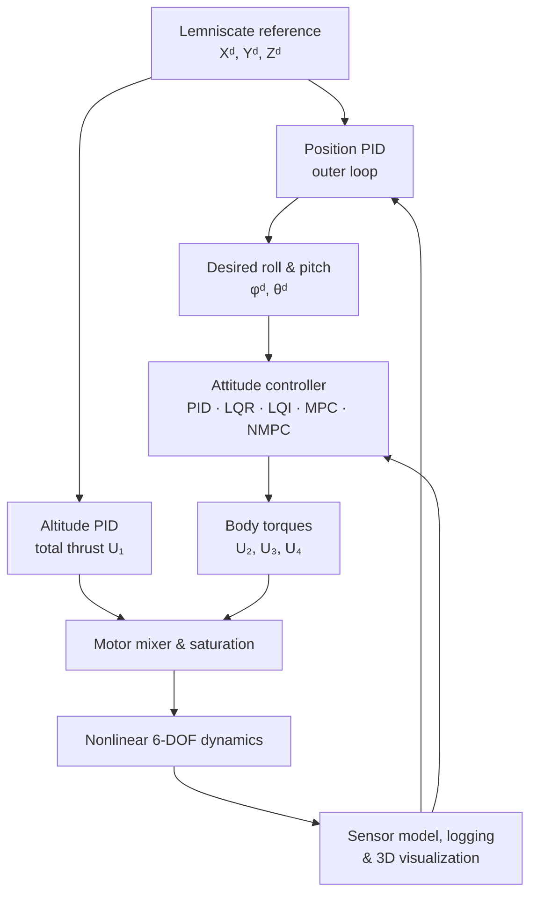

# Multirotor MATLAB Control Testbed

> 비선형 쿼드로터 모델에서 PID, LQR, LQI, MPC, NMPC를 구현하고 Lemniscate(∞) 경로 추종 성능을 비교하는 MATLAB 시뮬레이션 프로젝트입니다.

<p align="center">
  
  
</p>
<p align="center"><sub>LQR simulation (left) · MPC simulation (right)</sub></p>

## Project at a glance

- 6-DOF nonlinear quadrotor dynamics and Euler-angle kinematics
- 100 Hz discrete-time closed-loop simulation (`Ts = 0.01 s`)
- Cascaded position/attitude control architecture
- PID, LQR, LQI, linear MPC, and nonlinear MPC implementations
- Motor control allocation with rotor-speed saturation
- Lemniscate trajectory generation and 3D animation
- RMSE, MAE, and maximum-error based controller evaluation
- Optional attainable control set (ACS) and actuator-fault analysis

The current configuration in `quadrotor_sim.m` uses an **outer-loop position PID**, an **altitude PID**, and an **inner-loop attitude NMPC**. Simulink models are included, but the main experiments are script-based MATLAB simulations.

## What I implemented and extended

This repository extends [Wil Selby's MatlabQuadSimAP](https://github.com/wilselby/MatlabQuadSimAP) baseline into a controller-comparison testbed.

- Derived and linearized the attitude dynamics for LQR/LQI/MPC design
- Implemented interchangeable attitude controllers: PID, LQR, LQI, MPC, and NMPC
- Built a constrained NMPC using nonlinear prediction, RK4 integration, and `fmincon`
- Added a Gerono lemniscate reference generator for repeated trajectory-tracking tests
- Added motor mixing, actuator saturation, measurement noise, and disturbance hooks
- Logged actual/reference trajectories and calculated RMSE, MAE, and maximum error
- Added ACS visualization and rotor-fault scenarios as an optional analysis module

## Control architecture



### One simulation step

| Step | Module | Purpose |
|---:|---|---|
| 1 | Sensor model | Apply GPS, barometer, accelerometer, and gyro error models |
| 2 | Trajectory generator | Produce the desired Gerono lemniscate position |
| 3 | Frame transformation | Convert global-frame position/velocity information to the body frame |
| 4 | Position PID | Convert X/Y position errors into desired pitch/roll angles |
| 5 | Attitude + altitude control | Compute total thrust `U1` and body torques `U2-U4` |
| 6 | Motor mixer | Convert thrust/torque commands to four rotor speeds and apply limits |
| 7 | Nonlinear plant | Update translation, rotation, and Euler angles |
| 8 | Evaluation | Log data, update the 3D model, and calculate tracking metrics |

## Controllers

| Controller | Implementation | Main idea |
|---|---|---|
| Cascaded PID | `attitude_PID.m`, `rate_PID.m` | Position → attitude → angular-rate feedback loops |
| LQR | `attitude_LQR.m` | Full-state feedback using a gain derived from the linearized hover model |
| LQI | `attitude_LQI.m` | LQR with integral error states for offset rejection |
| Linear MPC | `attitude_MPC.m` | Augmented discrete model, 15-step horizon, constrained QP solved with `quadprog` |
| **Nonlinear MPC** | `attitude_NMPC.m` | Nonlinear 6-state prediction, RK4 integration, and constrained optimization with `fmincon` |

### NMPC formulation

The NMPC attitude state and reference are

$$
x = [\phi,\ p,\ \theta,\ q,\ \psi,\ r]^T, \qquad
x_{ref} = [\phi_d,\ 0,\ \theta_d,\ 0,\ \psi_d,\ 0]^T.
$$

At every 10 ms step, the controller predicts 15 future states and minimizes

$$
J = \sum_{k=1}^{N_p}
(x_k-x_{ref})^TQ(x_k-x_{ref})
+ \sum_{k=1}^{N_c}\Delta u_k^TR\Delta u_k,
$$

subject to torque and torque-rate limits. Only the first optimized input is applied, and the optimization is repeated at the next step (receding-horizon control). Altitude is controlled separately by a PID loop that produces total thrust `U1`.

## Reference trajectory

The test path is a Gerono lemniscate:

$$
X_d=a\sin(\omega t), \qquad
Y_d=a\sin(\omega t)\cos(\omega t), \qquad
Z_d=1+b\sin(2\omega t).
$$

This continuously excites both lateral axes and makes controller lag, overshoot, and actuator-limit effects easy to compare.

## Results

The following metrics were transcribed from the archived simulation results included with this repository. Lower is better.

### Reference-period setting: 1.0

| Inner-loop controller | 3D RMSE (m) | 3D MAE (m) |
|---|---:|---:|
| PID | 0.1030 | 0.0698 |
| LQR | 0.1021 | 0.0686 |
| LQI | 0.1014 | 0.0672 |
| MPC | 0.1014 | 0.0674 |
| **NMPC** | **0.1012** | **0.0669** |

### Faster reference-period setting: 0.3

| Inner-loop controller | 3D RMSE (m) | 3D MAE (m) |
|---|---:|---:|
| PID | 0.2371 | 0.2235 |
| MPC | 0.1544 | 0.1339 |
| **NMPC** | **0.1526** | **0.1312** |

In the faster-reference test, NMPC reduced 3D RMSE by **35.6%** and 3D MAE by **41.3%** relative to the cascaded PID result. MPC and NMPC retained the same qualitative figure-eight path more effectively as the reference became more demanding.

> The reported 3D metrics include the initial altitude transition from `Z = 0 m` to the `Z = 1 m` reference. Consequently, the maximum 3D error is dominated by takeoff rather than steady-state path tracking. These images are archived experiment runs; exact results can change with controller weights, noise realization, and trajectory parameters.

<p align="center">
  
</p>

<details>
<summary><strong>Open all controller result plots</strong></summary>

### Reference-period setting 1.0

<p align="center">
  
  
</p>
<p align="center">
  
  
</p>
<p align="center">
  
</p>

### Faster reference-period setting 0.3

<p align="center">
  
  
</p>
<p align="center">
  
</p>

</details>

## Model and simulation parameters

| Parameter | Default value |
|---|---:|
| Sampling time | 0.01 s |
| Simulation rate | 100 Hz |
| Simulation duration | 100 s |
| Vehicle mass | 1.4 kg |
| Arm length | 0.56 m |
| Inertia | `Jx=0.05`, `Jy=0.05`, `Jz=0.24 kg·m²` |
| Maximum rotor speed | 925 rad/s |
| Roll/pitch command limit | ±45° |
| Coordinate convention | NED-style model; plotting flips Y/Z for visualization |

## Repository map

```text
Multirotor-matlab-testbed/
├── MatlabQuadSimAP-master/
│   ├── quadrotor_sim.m          # main script-based experiment
│   ├── quadrotor_sim_origin.m   # baseline cascaded-PID version
│   ├── model_dynamics.m         # symbolic model, linearization, LQR/LQI/MPC setup
│   ├── quad_ACS.m               # optional attainable-control-set analysis
│   ├── QuadrotorSimulink.mdl    # optional Simulink model
│   └── utilities/
│       ├── attitude_NMPC.m      # active nonlinear attitude controller
│       ├── position_PID.m       # outer-loop position controller
│       ├── quad_motor_speed.m   # control allocation and actuator saturation
│       ├── quad_dynamics_nonlinear.m
│       ├── Trajectory_Lemniscate.m
│       ├── calculate_performance.m
│       └── plot_*.m             # animation and result plots
└── docs/assets/                 # README animations and archived result plots
```

## Requirements

- MATLAB
- Optimization Toolbox — `fmincon`, `quadprog`
- Control System Toolbox — `lqrd`, `ss`, `damp`, `step`, `initial`
- Symbolic Math Toolbox — symbolic dynamics and Jacobian-based linearization
- Simulink — optional; not required for the main script-based workflow
- `lcon2vert` / `vert2lcon` utilities — required only for ACS analysis

## Run

```matlab
cd MatlabQuadSimAP-master
quadrotor_sim
```

The active controller is selected inside the attitude-controller section of `quadrotor_sim.m`. Enable exactly one attitude-control path at a time. For a controller-only tracking run, the optional `model_dynamics` and `quad_ACS` pre-analysis calls can be disabled to reduce startup calculations and extra figures.

## Evaluation outputs

After a run, the simulator provides:

- Live 3D quadrotor animation
- X/Y/Z position histories
- Roll/pitch/yaw histories and references
- Total thrust and body-torque histories
- Four rotor-speed histories
- Simulated-versus-reference 3D trajectory
- Per-axis and total 3D RMSE, MAE, and maximum error

## Acknowledgement

The visualization and baseline quadrotor simulation structure originate from [wilselby/MatlabQuadSimAP](https://github.com/wilselby/MatlabQuadSimAP). This repository focuses on extending that baseline with controller design, constrained predictive control, trajectory tracking, actuator analysis, and quantitative evaluation.
