# Multirotor MATLAB Control Testbed

> 비선형 쿼드로터(Nonlinear Quadrotor) 모델에서 PID, LQR, LQI, MPC, NMPC를 구현하고, Lemniscate(∞) 경로 추종 성능을 비교한 MATLAB 제어 시뮬레이션 프로젝트입니다.

<table>
  <tr>
    <th>PID–LQR Lemniscate Tracking</th>
    <th>PID–MPC Lemniscate Tracking</th>
  </tr>
  <tr>
    <td>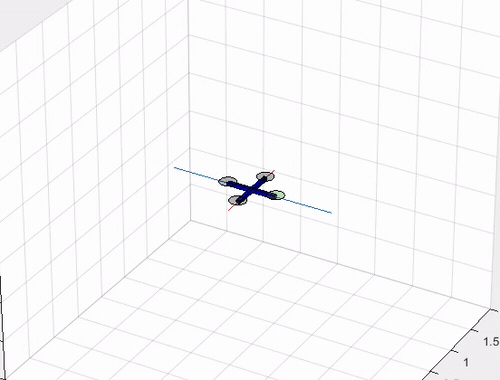</td>
    <td>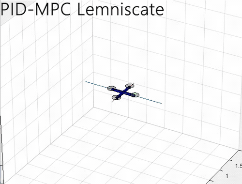</td>
  </tr>
</table>

## 프로젝트 개요 | Overview

이 프로젝트는 쿼드로터의 **6-DOF nonlinear dynamics**를 MATLAB으로 구현하고, 동일한 비행체와 기준 경로에서 여러 자세 제어기의 특성을 비교하기 위한 script-based testbed입니다.

- 100 Hz discrete-time closed-loop simulation (`Ts = 0.01 s`)
- Position–attitude cascaded control architecture
- PID, LQR, LQI, Linear MPC, Nonlinear MPC 구현
- Motor control allocation과 rotor-speed saturation 반영
- Lemniscate reference trajectory 생성
- 3D animation과 실제/기준 궤적 시각화
- RMSE, MAE, Maximum Error 기반 정량 평가
- 멀티로터의 정상과 고장 상태에서의 ACS(Attainable Control Set) 분석

현재 `quadrotor_sim.m`의 기본 구성은 **Position PID + Altitude PID + Attitude NMPC**입니다. Simulink 모델도 포함되어 있지만, 주요 실험은 `.m` 파일을 중심으로 수행합니다.

## 핵심 구현 | Key Contributions

이 레포지토리는는 [Wil Selby의 MatlabQuadSimAP](https://github.com/wilselby/MatlabQuadSimAP)를 기반으로 확장한 프로젝트입니다.

- Hover equilibrium에서 자세 동역학을 선형화하고 LQR/LQI gain 설계
- PID, LQR, LQI, MPC, NMPC를 교체 가능한 attitude controller로 구현
- Augmented model과 `quadprog`를 사용한 constrained Linear MPC 구현
- Nonlinear prediction, RK4, `fmincon`을 사용한 constrained NMPC 구현
- Lemniscate trajectory generator 및 반복 경로 추종 실험 구성
- Motor mixing, actuator saturation, sensor noise, disturbance hook 반영
- 실제/기준 궤적 logging과 성능 지표 자동 계산
- 정상·모터 고장 조건의 ACS 시각화 모듈 추가

## 제어 구조 | Compact Control Architecture

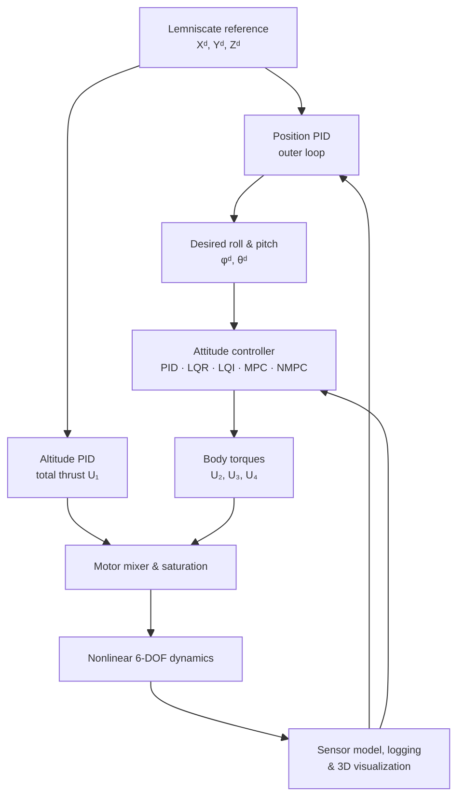

### 매 시간 스텝의 처리 과정 | One Simulation Step

| Step | 모듈 | 수행 내용 |
|---:|---|---|
| 1 | Sensor model | GPS, barometer, accelerometer, gyro 오차를 모사 |
| 2 | Trajectory generator | 목표 Lemniscate 위치 `Xd, Yd, Zd` 생성 |
| 3 | Frame transformation | Global-frame 위치·속도를 Body frame으로 변환 |
| 4 | Position PID | X/Y 위치 오차를 목표 pitch/roll로 변환 |
| 5 | Attitude + altitude control | 총추력 `U1`과 body torque `U2-U4` 계산 |
| 6 | Motor mixer | 제어입력을 네 rotor speed로 변환하고 포화 적용 |
| 7 | Nonlinear dynamics | 위치, 속도, body rate, Euler angle 갱신 |
| 8 | Evaluation | 로그 저장, 3D model 갱신, tracking metric 계산 |

## 제어기 구성 | Controller Set

| 제어기 | 구현 파일 | 핵심 특징 |
|---|---|---|
| Cascaded PID | `attitude_PID.m`, `rate_PID.m` | Position → attitude → angular-rate feedback |
| LQR | `attitude_LQR.m` | Hover 선형모델의 full-state optimal feedback |
| LQI | `attitude_LQI.m` | LQR 상태에 integral error를 추가해 offset 보상 |
| Linear MPC | `attitude_MPC.m` | Augmented discrete model, 15-step horizon, constrained QP |
| **Nonlinear MPC** | `attitude_NMPC.m` | Nonlinear prediction, RK4, constrained NLP |

아래 전개는 프로젝트에서 사용한 강의자료의 흐름과 실제 MATLAB 구현을 함께 반영했습니다. GitHub 수식 렌더링 차이로 식이 깨지는 문제를 막기 위해 모든 핵심 식을 고정폭 text block으로 표기했습니다.

<details>
<summary><strong>LQR — Linear Quadratic Regulator 전개 보기</strong></summary>

### 1. Hover 근처 자세 모델

기체가 hover equilibrium 근처에서 작은 자세 변화만 만든다고 가정합니다.

```text
sin(phi) ≈ phi,  sin(theta) ≈ theta
cos(phi) ≈ 1,    cos(theta) ≈ 1
phi_dot ≈ p,     theta_dot ≈ q,     psi_dot ≈ r
```

자세 상태와 제어입력은 다음과 같습니다.

```text
x = [phi, p, theta, q, psi, r]^T
u = [tau_x, tau_y, tau_z]^T
```

비선형 회전 동역학을 hover equilibrium에서 Jacobian으로 선형화합니다.

```text
x_dot = A x + B u
y     = C x

A = df/dx evaluated at x = 0
B = df/du evaluated at x = 0
```

### 2. Optimal control problem

LQR은 상태 오차와 제어입력을 동시에 줄이는 gain `K`를 계산합니다.

```text
J = integral { (x - x_ref)^T Q (x - x_ref) + u^T R u } dt

A^T P + P A - P B R^(-1) B^T P + Q = 0
K = R^(-1) B^T P
u* = -K (x - x_ref)
```

### 3. 코드 적용

`model_dynamics.m`이 `A`, `B`를 만들고 `lqrd`로 0.01초 주기의 discrete LQR gain을 계산합니다.

```text
Q = diag([1000, 1, 1000, 1, 10, 1])
R = diag([10, 10, 10])
K = lqrd(A, B, Q, R, 0.01)
```

`attitude_LQR.m`은 현재 자세·각속도와 목표 자세의 오차에 `-K`를 적용하여 `U2, U3, U4`를 생성합니다. 고도축 `U1`은 별도의 PID가 담당합니다.

</details>

<details>
<summary><strong>MPC — Linear Model Predictive Control 전개 보기</strong></summary>

### 1. Discrete prediction model

선형화한 연속 모델을 0.01초 주기로 이산화합니다.

```text
x(k+1) = Ad x(k) + Bd u(k)
y(k)   = Cd x(k)
```

미래 상태를 반복 전개하면 다음과 같습니다.

```text
x(k+1|k) = A x(k) + B u(k)
x(k+2|k) = A^2 x(k) + A B u(k) + B u(k+1)
...
Y        = P x_aug(k) + H DeltaU
```

여기서 `P`와 `H`는 `calculate_prediction_matrices.m`이 만드는 stacked prediction matrix입니다. 코드에서는 상태 변화량과 현재 출력을 결합한 augmented state를 사용합니다.

### 2. Quadratic programming

```text
minimize:
  J = (R_s - Y)^T Q_bar (R_s - Y) + DeltaU^T R_bar DeltaU

subject to:
  CC DeltaU <= dd + dupast u(k-1)
```

이를 표준 QP 형태로 정리합니다.

```text
H_qp = 2 (H^T Q_bar H + R_bar)
f_qp = -2 H^T Q_bar (R_s - P x_aug)

DeltaU* = quadprog(H_qp, f_qp, constraints)
```

### 3. Receding-horizon control

Prediction horizon과 control horizon은 모두 15 step입니다. 최적화된 `DeltaU` 중 첫 번째 입력 변화량만 적용하고, 다음 10 ms 스텝에서 다시 최적화합니다.

</details>

<details>
<summary><strong>NMPC — Nonlinear Model Predictive Control 전개 보기</strong></summary>

### 1. Nonlinear state model

NMPC는 선형화 행렬 대신 원래의 자세 비선형식을 직접 예측에 사용합니다.

```text
x = [phi, p, theta, q, psi, r]^T
u = [U2, U3, U4]^T

x_dot = f(x, u)
x(k+1) = RK4(x(k), u(k), Ts)
```

`prediction_model`은 RK4로 각 미래 상태를 계산하며, yaw error는 `atan2(sin(e), cos(e))`로 wrap 처리합니다.

### 2. Nonlinear optimization

```text
x_ref = [phi_des, 0, theta_des, 0, psi_des, 0]^T

J = sum { (x_pred - x_ref)^T Qx (x_pred - x_ref)
          + DeltaU^T Ru DeltaU }

umin <= u(k) <= umax
-DeltaUmax <= DeltaU(k) <= DeltaUmax
```

코드 설정은 다음과 같습니다.

```text
Qx = diag([1000, 1, 1000, 1, 10, 1])
Ru = diag([100, 100, 100])
Np = 15,  Nc = 15
solver = fmincon(active-set)
```

### 3. Control application

`fmincon`으로 계산한 첫 번째 torque increment만 실제 기체에 적용합니다. Solver가 해를 찾지 못하면 이전 입력을 유지하고 warm-start sequence를 초기화합니다. 고도 `U1`은 LQR/MPC와 동일하게 별도 PID에서 계산합니다.

</details>

## 기준 경로 | Reference Trajectory

실험 경로는 Gerono Lemniscate입니다.

```text
Xd = a sin(omega t)
Yd = a sin(omega t) cos(omega t)
Zd = 1 + b sin(2 omega t)
```

X/Y 두 축을 연속적으로 가진하므로 controller lag, overshoot, actuator limit에 따른 경로 변형을 한눈에 비교하기 좋습니다.

## 실험 결과 | Controller Comparison

아래 수치는 제공된 archived simulation result에서 정리했습니다. RMSE와 MAE는 낮을수록 좋습니다.

### 정량 비교 | Tracking Metrics

#### Reference Period 1.0

| Controller | 3D RMSE (m) | 3D MAE (m) |
|---|---:|---:|
| PID | 0.1030 | 0.0698 |
| LQR | 0.1021 | 0.0686 |
| LQI | 0.1014 | 0.0672 |
| MPC | 0.1014 | 0.0674 |
| **NMPC** | **0.1012** | **0.0669** |

#### Reference Period 0.3

| Controller | 3D RMSE (m) | 3D MAE (m) |
|---|---:|---:|
| PID | 0.2371 | 0.2235 |
| MPC | 0.1544 | 0.1339 |
| **NMPC** | **0.1526** | **0.1312** |

Reference Period 0.3 실험에서는 MPC와 NMPC의 평균 3D 추종 오차가 PID보다 작았습니다. 그중 NMPC는 PID 대비 **3D RMSE 35.6%**, **3D MAE 41.3%** 낮았습니다.

> 3D metric에는 `Z = 0 m`에서 `Z = 1 m`로 이동하는 초기 고도 과도응답이 포함됩니다. 따라서 Maximum Error는 steady-state tracking보다 초기 이륙 오차의 영향을 크게 받습니다. 결과는 controller weight, noise seed, trajectory parameter에 따라 달라질 수 있습니다.

### Reference Period 1.0 — Controller별 경로 추종 결과

<table>
  <tr>
    <th>PID–PID · Reference Period 1.0</th>
    <th>PID–LQR · Reference Period 1.0</th>
  </tr>
  <tr>
    <td>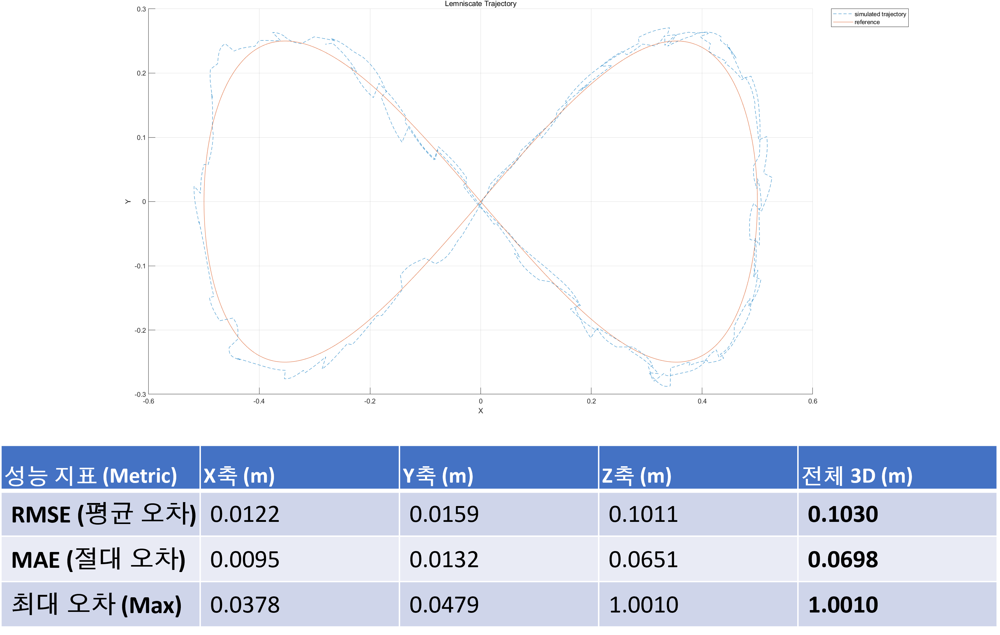</td>
    <td>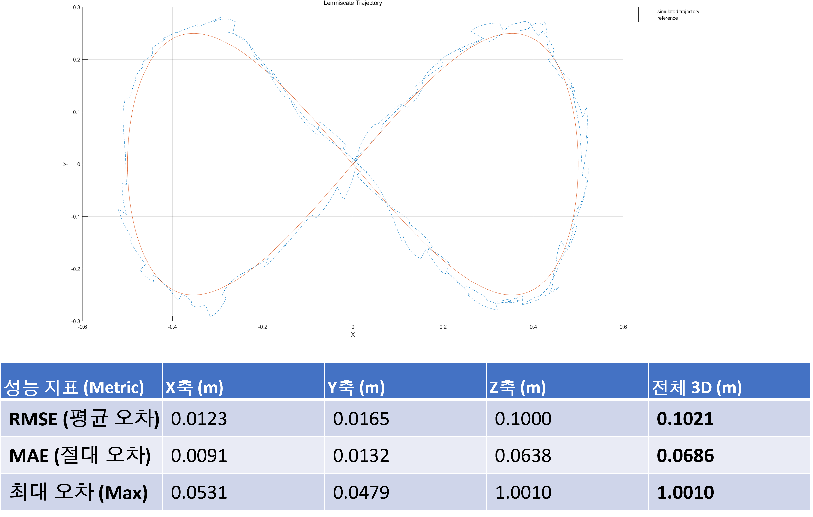</td>
  </tr>
  <tr>
    <th>PID–LQI · Reference Period 1.0</th>
    <th>PID–MPC · Reference Period 1.0</th>
  </tr>
  <tr>
    <td>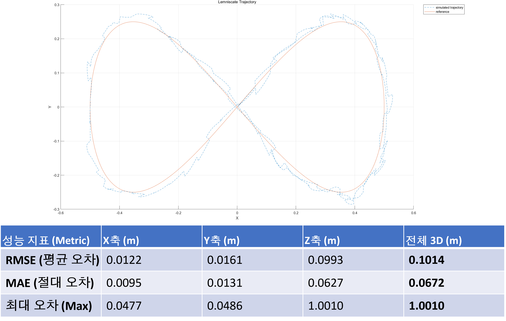</td>
    <td>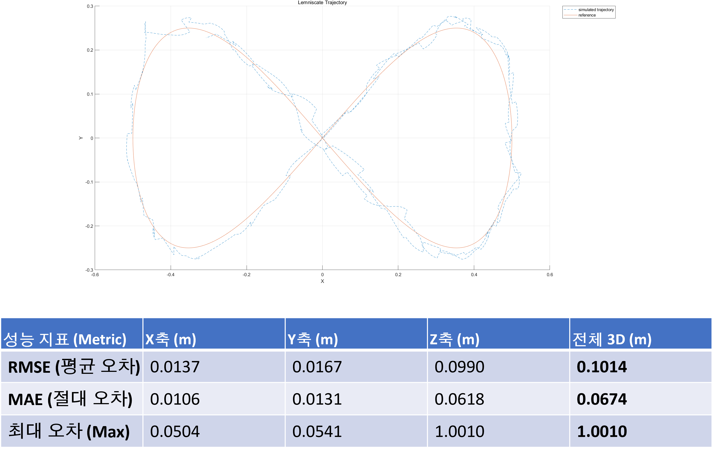</td>
  </tr>
  <tr>
    <th colspan="2">PID–NMPC · Reference Period 1.0</th>
  </tr>
  <tr>
    <td colspan="2" align="center">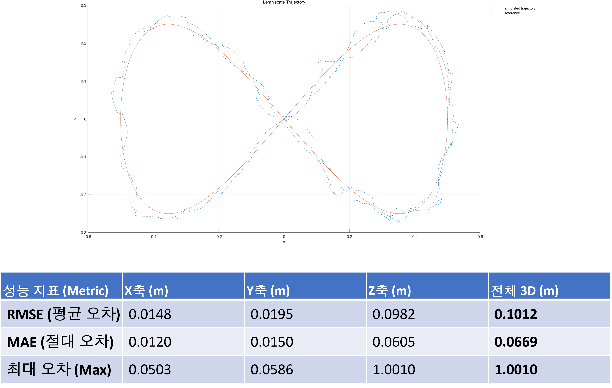</td>
  </tr>
</table>

### Reference Period 0.3 — Controller별 경로 추종 결과

<table>
  <tr>
    <th>PID–PID · Reference Period 0.3</th>
    <th>PID–MPC · Reference Period 0.3</th>
  </tr>
  <tr>
    <td>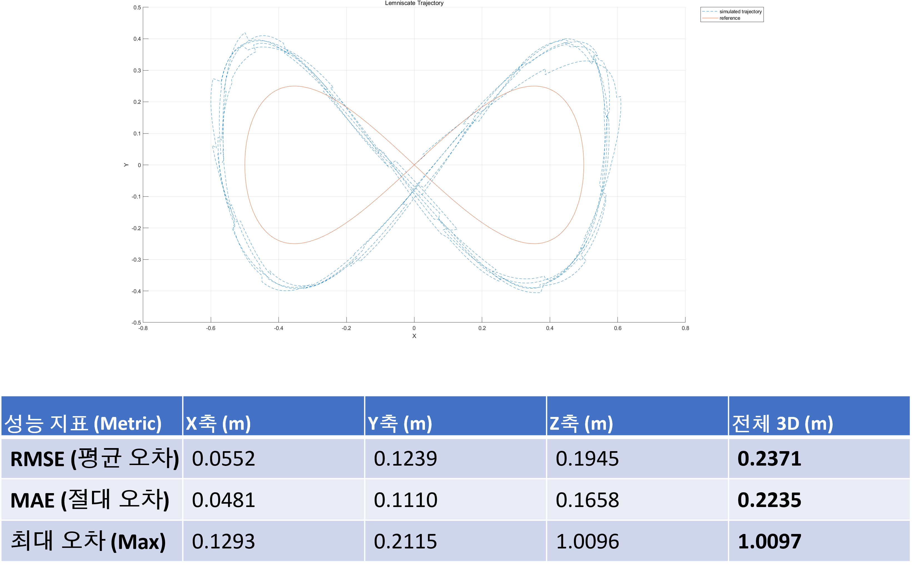</td>
    <td>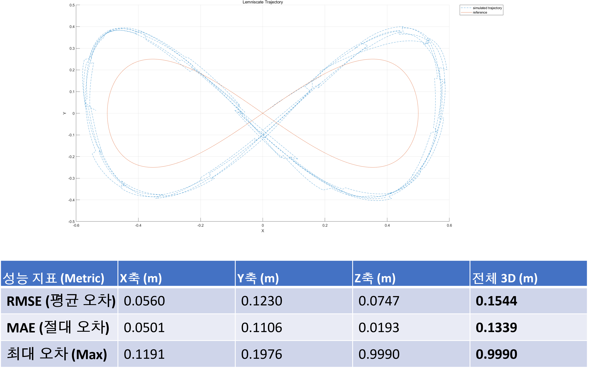</td>
  </tr>
  <tr>
    <th colspan="2">PID–NMPC · Reference Period 0.3</th>
  </tr>
  <tr>
    <td colspan="2" align="center">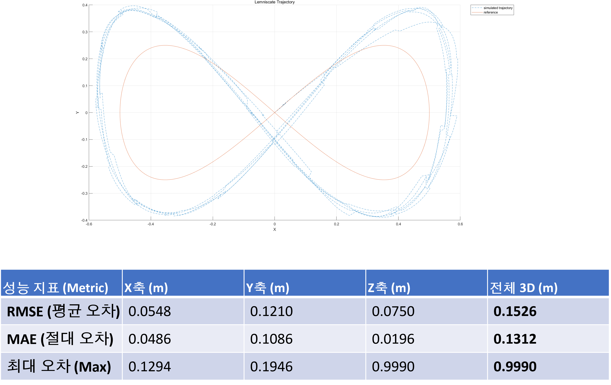</td>
  </tr>
</table>

## 모델 및 시뮬레이션 설정 | Parameters

| Parameter | Default value |
|---|---:|
| Sampling time | 0.01 s |
| Simulation rate | 100 Hz |
| Simulation duration | 100 s |
| Vehicle mass | 1.4 kg |
| Arm length | 0.56 m |
| Inertia | `Jx=0.05`, `Jy=0.05`, `Jz=0.24 kg·m²` |
| Maximum rotor speed | 925 rad/s |
| Roll/Pitch command limit | ±45° |
| Coordinate convention | NED-style model; 시각화 시 Y/Z 부호 변환 |

## 실행 방법 | Run

### Requirements

- MATLAB
- Optimization Toolbox — `fmincon`, `quadprog`
- Control System Toolbox — `lqrd`, `ss`, `damp`, `step`, `initial`
- Symbolic Math Toolbox — symbolic dynamics와 Jacobian linearization
- Simulink — optional, main script 실행에는 필수 아님
- `lcon2vert` / `vert2lcon` — ACS 분석을 실행할 때만 필요

### Main script

```matlab
cd MatlabQuadSimAP-master
quadrotor_sim
```

`quadrotor_sim.m`의 Attitude Controller 구간에서 사용할 제어기를 하나만 활성화합니다. 경로 추종 simulation만 빠르게 확인할 경우 optional pre-analysis인 `model_dynamics`와 `quad_ACS` 호출을 비활성화하면 startup 계산과 추가 figure 생성을 줄일 수 있습니다.

## 출력 항목 | Evaluation Outputs

- Live 3D quadrotor animation
- X/Y/Z position history
- Roll/Pitch/Yaw history와 reference
- Total thrust 및 body torque history
- 네 개 rotor의 speed history
- Simulated trajectory와 reference trajectory 비교
- 축별 및 전체 3D RMSE, MAE, Maximum Error

## 출처 | Acknowledgement

기본 쿼드로터 simulation structure와 visualization은 [wilselby/MatlabQuadSimAP](https://github.com/wilselby/MatlabQuadSimAP)을 기반으로 합니다. 본 저장소는 controller design, constrained predictive control, trajectory tracking, actuator analysis, quantitative evaluation을 중심으로 확장했습니다.
